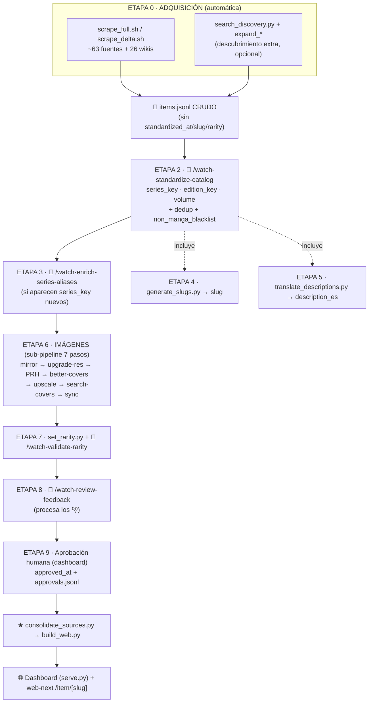
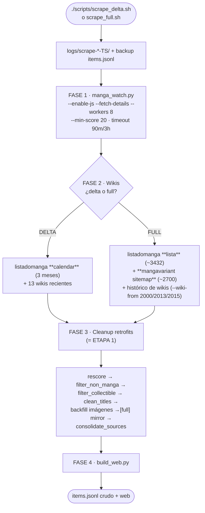
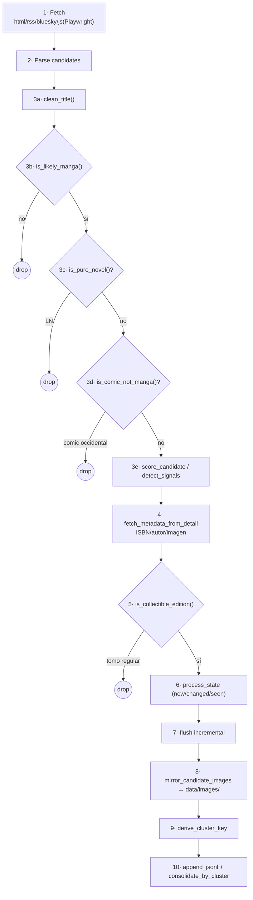
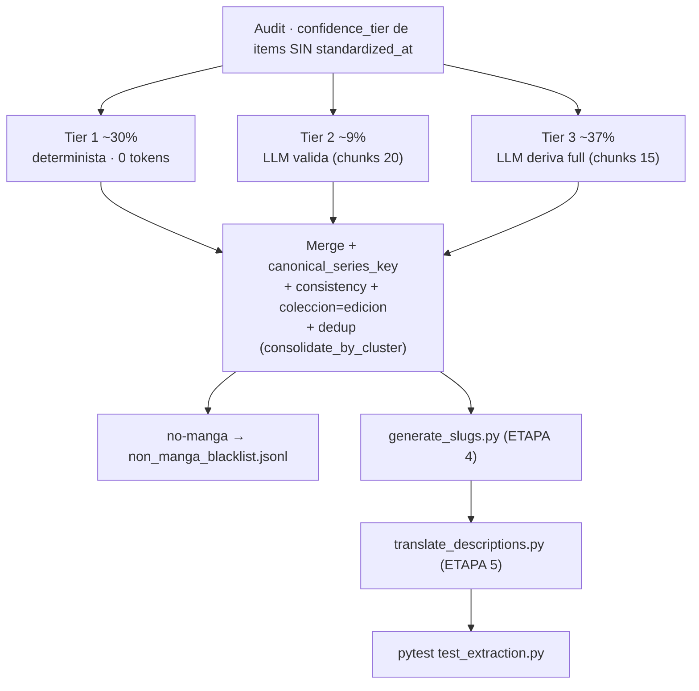

# Ciclo de vida del dato — runbook completo end-to-end

> ⚠️ **DOCUMENTO VIVO — mantener SIEMPRE sincronizado.** Cada cambio en el flujo
> end-to-end o que impacte la base de datos (nueva etapa/paso del ciclo de vida,
> nuevo proceso post-scrape, reordenamiento de etapas, campo nuevo en
> `items.jsonl`, nueva funcionalidad del workflow) **se documenta acá en el mismo
> turn**. Es policy del repo (ver tabla "dónde va cada cambio" en CLAUDE.md).
>
> **Qué es este documento.** El proceso **completo** para llevar el dato de
> PandaWatch desde "no existe" hasta "100% listo para publicar": cómo se
> consigue en las distintas páginas, cómo se transforma/filtra, cómo se
> estandariza, cómo se consiguen y mejoran las fotos, cómo se traduce, cómo se
> generan los slugs, cómo se valida la rareza, cómo se procesa el feedback y
> cómo se aprueban los golden records — **en el orden en que conviene correrlo**.
>
> No es solo el scrape: el scrape es la **Etapa 0**. Las etapas 1–9 son los
> procesos que dejan el dato realmente completo.
>
> Niveles de lectura:
> 0. [Vista de pájaro](#0-vista-de-pájaro-todo-el-flujo-de-un-vistazo) — el flujo entero en un solo gráfico.
> 1. [Mapa de etapas](#1-mapa-de-etapas-el-orden-completo) — el ciclo entero de un vistazo.
> 2. [Diagramas de flujo](#2-diagramas-de-flujo) — visual, por sub-proceso.
> 3. [Detalle por etapa](#3-detalle-por-etapa) — cada paso, comando por comando.
> 4. [Runbooks listos para copiar](#4-runbooks-listos-para-copiar).
>
> Referencias: [`CLAUDE.md`](../../CLAUDE.md), [`ARCHITECTURE.md`](ARCHITECTURE.md),
> [`SOURCES.md`](SOURCES.md), [`scripts/retrofit/README.md`](../../scripts/retrofit/README.md),
> [`docs/reference/images.md`](../reference/images.md),
> [`docs/reference/gotchas.md`](../reference/gotchas.md),
> [`FRD-006-slug-generation.md`](../web-next/FRD-006-slug-generation.md).

---

## 0. Vista de pájaro (todo el flujo de un vistazo)

> **Herramienta: Mermaid.** Es la mejor opción para este repo porque GitHub (y
> VS Code, Obsidian, GitLab) lo renderiza **nativo** desde un bloque ` ```mermaid `,
> sin paso de build ni servidor, y el diagrama es **texto** — versionable y
> revisable en PRs como el resto del código. (Alternativas evaluadas: **D2** tiene
> mejor auto-layout pero no renderiza nativo en ningún lado — necesita compilar a
> SVG/PNG; **PlantUML** requiere un servidor Java. Para docs en Markdown, Mermaid
> gana.) Si querés editarlo visualmente: [mermaid.live](https://mermaid.live).

El flujo completo, de la web hasta el dashboard, en 6 bloques. **Azul** = automático
(scrape); **gris** = dato crudo; **morado** = curación con IA (skills); **verde** =
enriquecimiento mecánico; **ámbar** = decisión humana; **turquesa** = publicación.

```mermaid
flowchart LR
    WEB["🌍 ~63 fuentes + 26 wikis<br/>20 países · 14 idiomas"]:::src
    SCRAPE["⚙️ SCRAPE<br/>full / delta<br/>(fetch · filtra · puntúa)"]:::auto
    RAW["📄 items.jsonl<br/>CRUDO"]:::raw
    CURATE["🧠 CURACIÓN IA<br/>standardize · aliases · feedback<br/>(serie · edición · volumen)"]:::ai
    ENRICH["✨ ENRIQUECIMIENTO<br/>imágenes hi-res · traducción<br/>slugs · rareza"]:::enr
    APPROVE["✅ APROBACIÓN<br/>humana<br/>(golden records)"]:::human
    PUB["🌐 PUBLICACIÓN<br/>dashboard + web-next<br/>/item/[slug]"]:::pub

    WEB --> SCRAPE --> RAW --> CURATE --> ENRICH --> APPROVE --> PUB

    classDef src    fill:#e3f2fd,stroke:#1565c0,color:#0d2b4e
    classDef auto   fill:#bbdefb,stroke:#1565c0,color:#0d2b4e
    classDef raw    fill:#eceff1,stroke:#607d8b,color:#263238
    classDef ai     fill:#ede7f6,stroke:#6a1b9a,color:#311b4e
    classDef enr    fill:#e8f5e9,stroke:#2e7d32,color:#1b3a1f
    classDef human  fill:#fff8e1,stroke:#f9a825,color:#5b4300
    classDef pub    fill:#e0f2f1,stroke:#00897b,color:#003d36
```



**Cómo leerlo:** cada bloque entrega lo que el siguiente necesita. El scrape consigue
el dato y lo deja crudo; la curación IA le pone identidad (qué serie/edición/volumen
es); el enriquecimiento lo completa (fotos buenas, traducción, slug, rareza); el humano
aprueba lo correcto (queda congelado); y se publica. El detalle de cada bloque —con sus
~15 pasos, comandos y campos— está en las secciones siguientes.

---

## 1. Mapa de etapas (el orden completo)

El dato pasa por **10 etapas**. Las etapas **0 y 1** son obligatorias siempre.
El resto se corre **según lo que cambió** (todos los procesos son idempotentes e
incrementales: solo tocan lo que falta).

| # | Etapa | Cómo se ejecuta | Output / campo que completa |
|---|---|---|---|
| **0** | **Adquisición** (scrape) | `scrape_full.sh` / `scrape_delta.sh` (automático) | filas crudas en `items.jsonl` |
| **0.5** | **Descubrimiento extra** (opcional) | `search_discovery.py` + `expand_*` | items nuevos vía Gemini/Tavily/DDG |
| **1** | **Transformación / limpieza** | retrofits de cleanup (dentro del scrape, Fase 3) | títulos limpios, filtros, `cluster_key`, `sources[]` |
| **2** | **Estandarización** 🧠 | skill `/watch-standardize-catalog` | `series_key`, `edition_key`, `volume`, `standardized_at` |
| **3** | **Aliases de series** 🧠 | skill `/watch-enrich-series-aliases` | `series_aliases.yml` + backfill |
| **4** | **Slugs** | `generate_slugs.py` (último paso del skill #2) | `slug` |
| **5** | **Traducción** | `translate_descriptions.py` (último paso del skill #2) | `description_es` |
| **6** | **Imágenes / portadas** | sub-pipeline de 7 pasos (ver §3.6) | `images[]` en hi-res (`images[0]` = portada; cada entry con `url`+`local`) |
| **7** | **Rareza** | `set_rarity.py` + skill `/watch-validate-rarity` 🧠 | `rarity`, `rarity_verified_at` |
| **8** | **Feedback** 🧠 | skill `/watch-review-feedback` | corrige errores reportados (👎) |
| **9** | **Aprobación humana** | dashboard → `approved_at` + `apply_approvals.py` | golden records congelados |
| **★** | **Build / publish** | `consolidate_sources.py` + `build_web.py` | `web/index.html` + web-next |
| **✔** | **Validación estructural** | `validate_corpus.py` (gate de salud, paso [5] de scrape_*.sh) | reporte de invariantes (0 violaciones duras = corpus válido) + warnings EDSLUG/SERIESDUP/EKPREFIX/PUBMIX (gotchas #69/#70/#71) |

🧠 = LLM-driven (skill). **Nunca corre solo** — el owner lo invoca por nombre (policy de tokens, CLAUDE.md).

**Regla de oro del flujo.** El scrape (Etapa 0/1) deja `items.jsonl` **crudo**
(sin `standardized_at`/`slug`/`description_es`/`rarity`). Todo lo demás es una
pasada **post-scrape**, manual o semi-manual, que el owner dispara cuando quiere.

**Orden corto recomendado** tras un scrape grande:

```
scrape → standardize → enrich-aliases → imágenes → rarity → translate → feedback → aprobar → build
         (slugs+translate van adentro de standardize)
```

---

## 2. Diagramas de flujo

### 2.1 Ciclo de vida completo (las 10 etapas)



### 2.2 Etapa 0 — el scrape automático (fases 1→4)



### 2.3 Per-source pipeline (qué le pasa a CADA candidato en Fase 1/2)



### 2.4 Etapa 2 — estandarización (skill, 3 tiers)



### 2.5 Etapa 6 — sub-pipeline de imágenes (orden recomendado)

```mermaid
flowchart LR
    A["mirror_images.py<br/>(espejo histórico)"] --> B["upgrade_image_resolution.py<br/>(quita params CDN)"]
    B --> GC1["mirror_images --gc"]
    GC1 --> C["backfill_prh_covers.py<br/>(EN · ISBN→PRH CDN)"]
    C --> D["fetch_better_covers.py<br/>(ISBN CDN + Tavily)"]
    D --> E["upscale_images.py<br/>(AI upscale JP thumbs)"]
    E --> F["🧠 /watch-search-covers<br/>→ cover_preview.json"]
    F --> APPR["aprobación manual<br/>cover-preview.html"]
    APPR --> G["sync_cover_images.py<br/>(saneamiento dups/junk)"]
```



---

## 3. Detalle por etapa

### 3.0 ETAPA 0 — Adquisición (el scrape)

Dos corridas canónicas, misma estructura (4 fases), misma diferencia central:
**solo cambia el discovery de listadomanga + el alcance histórico**.

| Script | listadomanga | Extra | Frecuencia | Tiempo |
|---|---|---|---|---|
| `scrape_delta.sh` | `--coleccion-mode calendar` (3 meses, ~500-600 colecciones) | wikis recientes | diaria/semanal | ~30-60 min |
| `scrape_full.sh` | `--coleccion-mode lista` (~3432 colecciones) | **+ mangavariant** (~2700) + histórico de wikis + galería + mirror | mensual/trimestral | ~2-4 h |

#### Convenciones de ambos scripts
- `set +e` (si una fase falla, las demás corren). Logs por sub-paso en `logs/scrape-{delta,full}-<TS>/`.
- Skippeable por env var: `SKIP_SCRAPE` / `SKIP_WIKIS` / `SKIP_CLEANUP` / `SKIP_BUILD`.
- `_run_timed` (timeout portable) por fuente — una colgada no bloquea el resto.
- Backup de `items.jsonl` antes de tocar (`backup_and_rotate`, 3 copias).
- **Lock global `data/.scrape.lock`** (2026-06-12): mkdir atómico + PID; una segunda
  corrida (delta o full) aborta sola en vez de corromper items.jsonl. Lock stale
  (PID muerto) se recupera automáticamente.
- **[4f3] `enforce_listadomanga_rules.py --fast`** corre en la FASE 3 de ambos
  (cadena completa de agrupación, incluye merge ISBN/series, dedup sintético,
  consolidate y slugs — invariantes DUPSYN/TITLE/DUPVOL/ISBNDUP).
- **PHASE 6 `source_health.py --last-n 1`** al cierre de ambos: el resumen de fuentes
  con errores/0-candidatos de ESTE run queda en `logs/scrape-*/06-source-health.md`.

#### Delta diario (programación)
`scripts/com.pandawatch.scrape-delta.plist` — LaunchAgent de macOS listo para correr
el delta todos los días a las 3:30 AM (instrucciones de instalación dentro del archivo;
NO está instalado por defecto — decisión del owner). Si la Mac duerme a esa hora,
launchd lo dispara al despertar. Con el lock global, un delta diario nunca pisa un
full manual en curso.

#### FASE 1 — sources del YAML
```bash
manga_watch.py --enable-js --fuzzy-keywords --max-pages 5 --fetch-details \
  --diagnostic --workers 8 --per-host-limit 2 --sleep-seconds 0.5 --min-score 20
```
- Lee `sources.yml` (~138 entradas, ~67-76 habilitadas), despacha cada fuente a `_scrape_one`.
- `ThreadPoolExecutor(workers=8)` + `Semaphore` por host. Fuentes `kind: js` → **Playwright worker thread + queue** dedicado (gotcha #12).
- Timeout 90 min (delta) / 3 h (full).

#### FASE 2 — Wiki bootstraps
La **diferencia central** full vs delta:

| | listadomanga | wikis extra |
|---|---|---|
| DELTA | `calendar`, `--wiki-from` últimos 3 meses | 15 wikis recientes (manga-sanctuary, otaku-calendar, manga-mexico, socialanime, blogbbm, sumikko, mangapassion, animeclick, prhcomics, kinokuniya, yenpress, shueisha, viz, **sevenseas**, **kodansha-us**) |
| FULL | `lista` ~3432, `--min-score 30` | **+ mangavariant sitemap ~2700** + cada wiki con `--wiki-from 2000/2013/2015` (histórico) + **sevenseas** (full, catálogo completo) + **kodansha-us** (full) |

Notas: `booksprivilege` **deshabilitado** (2026-05-26); `whakoom` y el histórico de `listadomanga-blog` son **opt-in/fuera** del canónico. Mangavariant: sus items son **siempre** manga válido (nunca van a blacklist). **`kodansha-us`** (alta 2026-06-12): API propia `/wp-json/kodansha/v1/search-series` + JSON-LD por volumen (~61 series especiales, ~200-300 vols). Reemplaza la fuente search `US - Kodansha USA (search)` que devolvía artículos de blog (0 candidatos). **`sevenseas`** (alta 2026-06-12): API WordPress, ~150-250 especiales EN.

Cada candidato pasa por el **per-source pipeline** (§3.0.bis).

#### FASE 3 = ETAPA 1 (cleanup) — ver §3.1.
#### FASE 4 — `build_web.py` — ver §3.★.

#### 3.0.bis Per-source pipeline (el corazón del scrape)
Detalle de los 10 pasos por cada candidato (vale para sources y wikis):

1. **Fetch** — `html`→requests (+paginación), `rss`→feedparser, `bluesky`→XRPC público, `js`→Playwright.
2. **Parse candidates** → `extract_listing_candidates` / `extract_rss` / `extract_bluesky_posts` → objetos `Candidate`.
3. **Filter & score**:
   - `clean_title()` — mojibake (round-trip cp1252/latin-1), prefijos/sufijos junk.
   - `is_likely_manga()` — cascada 4 reglas (HARD→STRONG→extras→SOFT→default) + filtro de tags (`type:oav`…).
   - `is_pure_novel()` — rechaza light novels (salvo adaptación/artbook).
   - `is_comic_not_manga()` — blacklist Marvel/DC (`comics_blacklist.yml`); bypass si el título dice "manga".
   - `score_candidate()` → `detect_signals()` (~70 keywords, **word-boundary regex no substring**, clamp [0,300]) → `signals`, `signal_types`, `product_type`, `stock_type`.
   - ⚠️ Invariante: `detect_signals` corre **solo sobre title+description**, nunca fuente/tags/keywords.
4. **Detail enrichment** (`--fetch-details`) — HTTP por item: JSON-LD → OpenGraph → `_extract_label_value_pairs` (FR/ES/EN/IT/JP) → fallbacks → name/author/image/isbn/release_date/publisher/description. `release_date` se normaliza a ISO (`normalize_release_date()`: YYYY-MM-DD, o YYYY-MM/YYYY si la fuente solo da granularidad parcial) en TODOS los puntos de asignación — al corpus no entran fechas crudas DD/MM/YYYY ni 年月日 (gotcha #80).
5. **Collectible gate** `is_collectible_edition()` — solo ediciones especiales/variants/deluxe/limited/boxsets/artbooks/fanbooks/magazines. Signals **recomputados desde el título** dentro del gate.
6. **State diff** `process_state()` — `content_hash` vs `state.json`: new/changed/seen.
7. **Flush incremental** — escribe tras CADA fuente (resiliencia).
8. **Image mirror** `mirror_candidate_images()` — descarga CADA imagen a `data/images/<sha256>.<ext>` y setea su `local` en `images[]` (`images[0]` = portada). `_extract_images_from_detail_soup` trae el carrusel a `images[]`. (Ya no hay campos top-level `image_url`/`image_local`; el `Candidate` runtime los lleva como input y `candidate_to_json` los vuelca en `images[0]`.)
9. **`derive_cluster_key`** — tiers `lmc:` > `edition:` > `isbn:` > `fuzzy:` > `url:`. Se deriva DESPUÉS de escribir el edition_key heurístico en el row (gotcha #65): la fila fresca entra ya consistente con la invariante CLKEY.
10. **Persist** `append_jsonl` — upsert por URL normalizada + `consolidate_by_cluster` (1 fila/producto + `sources[]`). Escritura atómica. `_CURATED_FIELDS` sticky (incluye `slug`/`detected_at`/`score`/`signals`/`signal_types` desde gotcha #65; el merge re-deriva `cluster_key` con los curados restaurados); `slug` es sticky para TODOS los items; `approved_at` congela la fila.

#### 0.5 — Descubrimiento extra (opcional, no es scrape)
- `search_discovery.py` — descubre items **nuevos** vía Gemini grounding → Tavily → DuckDuckGo HTML (queries en `data/search_queries.yml`). Corre ~1×/semana para ampliar corpus sin esperar al overnight.
- Tras un discovery, limpiar páginas-índice que entran como productos:
  - `expand_whakoom_ediciones.py` — convierte `/ediciones/<id>` en N filas por tomo.
  - `expand_index_pages.py` — expande/elimina `/publisher/`, Shopify multi-variant, `/blogs/news/`, `/collections/X` sin `/products/`.

---

### 3.1 ETAPA 1 — Transformación / limpieza (Fase 3 del scrape)

Cadena de retrofits que limpia y consolida lo recién scrapeado (corre **dentro** del scrape; también se puede correr suelta tras tocar reglas). **El orden importa.**

| Paso | Script | Qué hace |
|---|---|---|
| 4a | `rescore.py` | Recalcula `score`/`signals`/`signal_types`/`product_type`. **Guard gotcha #61 (2026-06-11)**: items con `standardized_at` se saltean por defecto (`--include-standardized` para override) — el paso es seguro sobre corpus estandarizado. |
| 4b | `filter_non_manga.py` | Re-aplica `is_likely_manga`+`is_pure_novel`+`is_comic_not_manga`; expulsa rechazados. |
| 4c | `filter_collectible.py` | Re-aplica `is_collectible_edition`; expulsa tomos regulares. ⚠️ puede quitar referencias Mangavariant — el skill standardize las preserva. **Guard de estandarizados (gotcha #61)**: items con `standardized_at` solo pasan gates duros (junk de título, umbrella_magazine URL-gate), bucket `kept_standardized` — NO se les recomputa `signal_types` desde el texto. `rescore.py` tiene el mismo guard desde 2026-06-11 (salta `standardized_at` por defecto). |
| 4d | `clean_titles.py` | Re-corre `clean_title` (mojibake, junk). |
| 4e | `backfill_metadata.py --only image_url` | Rellena portadas faltantes (HTTP por item). |
| 4e2 | `backfill_metadata.py --only images` | **[full]** galería multi-imagen (carrusel). |
| 4e3 | `mirror_images.py --no-gc` | **[full]** descarga galería al espejo local. |
| 4f | `wayback_recover.py` | **opt-in** — rescata items 404 vía archive.org. |
| 4f2 | `align_raw_to_std_coleccion.py` | Alinea items raw a la edición estandarizada de su MISMA coleccion (regla coleccion=edición). Evita el dup raw-vs-std al re-scrapear una colección ya conocida (ej. "Bastard!! nº1" vs "Bastard!! Deluxe 1"). Corre ANTES del enforcer para que el merge los fusione. |
| 4f3 | `enforce_listadomanga_rules.py --fast` | **Cadena COMPLETA de agrupación (2026-06-12)** — reemplaza a los pasos sueltos fix_edition_country / unify_coleccion / backfill_cluster_key / generate_slugs / consolidate / merge_isbn que el pipeline corría antes: el re-scrape del calendario sobre colecciones YA estandarizadas deja duplicados raw-vs-std (DUPSYN/DUPVOL/TITLE) que solo la cadena completa repara (la corrida real del delta del 2026-06-12 dejaba **53 violaciones duras** con la cadena vieja; con el enforcer → 0). `--fast` salta el dedup de carrusel (corre aparte en 4h). Incluye: edition_display, país=edición, anomalías ek, unify/disambiguate/collapse/merge_crosssource, títulos lmc, canonicalize slugs, merge series/ISBN dups, publishers, cluster_key, dedup sintético, consolidate, slugs. Idempotente. |
| 4g2 | `upgrade_image_resolution.py` | **[full only]** Re-descarga portadas en resolución completa: quita segmentos/params CDN de resize (Buscalibre `fit-in/`, Cultura `cdn-cgi/image/`, Whakoom `small→large`, Magento cache path, WP -NxM, Shopify _Nx, Rakuten `?_ex=`). Pasa Referer del item para evitar 403 anti-hotlink. Compara píxeles (`--min-gain 0.10`). Corre DESPUÉS de `consolidate_sources` (la portada canónica final ya está en su lugar) y ANTES de `dedup_carousel` (que puede necesitar la versión hi-res). |
| 4h | `dedup_carousel_images.py` | Quita la MISMA portada repetida en baja resolución del carrusel (hash perceptual; solo `kind=gallery`). Corre acá porque 4g une imágenes de fuentes hermanas → crea el dup. |

> Todos los retrofits que reescriben metadata descriptiva **saltean items `approved_at`** por defecto (guard `is_approved()`).

---

### 3.2 ETAPA 2 — Estandarización 🧠 `/watch-standardize-catalog`

Procesa items **sin `standardized_at`** (incremental). Nunca toca golden records. Es la **verificación/corrección** del rough-assignment que hizo el scraper (`derive_series_metadata` = pass 1; este skill = pass 2, gotcha #21).

> **Política de títulos (2026-06-12, gotcha #92)**: el `title` es el nombre OFICIAL
> scrapeado y esta etapa **NO lo toca** — no se traduce, no se renombra a la serie
> canónica, no se le inyecta tipo de edición. El campo `title_standardized` quedó
> RETIRADO. La encontrabilidad la da la búsqueda por aliases
> (`data/series_aliases.json`, ver ETAPA 3 y Build) y el tipo de edición se muestra
> como badge en las UIs. Detalle en architecture.md → "Política de títulos".

> **Anti-drift (2026-06-11)**: la lógica de audit/tiering y de merge que vivía COPIADA
> en `SKILL.md` y en el workflow (y había divergido) ahora es **fuente única** en dos
> scripts compartidos que ambos invocan: `scripts/standardize_audit.py` y
> `scripts/standardize_apply.py`.

**Flujo** (workflow con checkpoints en `data/standardize-progress.json`):
1. **Audit** — `standardize_audit.py` (flags `--limit`/`--force-all`; markers TOTAL/PENDING/TIER1/2/3) re-deriva `confidence_tier` y escribe proyecciones `tier{1,2,3}.json` con `proposed_*` (la propuesta heurística), `existing_edition_key` (el LLM NO re-agrupa items con edición asignada) y `known_edition_keys` (las keys YA existentes en el corpus para esa serie — el LLM debe REUSAR en vez de acuñar variantes special/limited, gotcha #69):
   - **Tier 1 ~30%**: serie en `series_aliases.yml`, publisher conocido → **determinista, 0 tokens**.
   - **Tier 2 ~9%**: edición ambigua → **LLM valida** la propuesta (chunks de 20).
   - **Tier 3 ~37%**: serie desconocida / CJK → **LLM deriva** desde cero (chunks de 15).
2. **Tier 1** — `standardize_apply.py tier1` aplica la heurística, marca `standardized_at`.
3. **Tier 2** — subagentes paralelos validan/corrigen contra allowlists de **publisher slug** + **edition slug** (output schema-validado; reglas anti-compound, artbook-vs-special, 画集付き=bonus; tabla determinística término→slug de tipo de edición, gotcha #69).
4. **Tier 3** — subagentes derivan todo desde cero.
5. **Merge** — `standardize_apply.py merge`: **preserva el `edition_key` existente**, fallback a la propuesta heurística si el LLM devolvió keys vacías (sin keys usables → el item queda PENDIENTE y se reintenta), `canonical_series_key()` (consolida multilingüe), outliers de serie por /coleccion, no-manga → `non_manga_blacklist.jsonl` (Mangavariant **nunca**), recomputa `cluster_key`, **fusiona duplicados** con `consolidate_by_cluster` (no borra — preserva fuentes hermanas) y emite reporte INTEGRITY.
6. **Enforcer** — `enforce_listadomanga_rules.py` (Step 6b del skill): re-aplica determinísticamente TODAS las reglas duras de agrupación sobre lo que el LLM dejó. Desde 2026-06-11 incluye 5 pasos nuevos (3c1 `canonicalize_edition_slugs.py` #69, 3c2 `merge_duplicate_series.py` #70, 3c3 `normalize_edition_publishers.py`, 3c4 `fix_edition_key_prefix.py` #71, 3c5 `fix_title_edition_words.py` #72, antes de `backfill_cluster_key`) y **ya no es solo-listadomanga**: esos pasos aplican a todas las fuentes. Además el **paso 4b** re-corre `fix_lmc_display_titles` + `fix_especial_title_order` DESPUÉS de consolidate — el merge de filas podía revivir un título contaminado ya limpiado y el enforcer necesitaba 2 pasadas para converger; con 4b converge en UNA (verificado: 2ª corrida → items.jsonl byte-idéntico).
7. **→ ETAPA 4 (slugs)** y **→ ETAPA 5 (traducción)**.
8. `pytest tests/test_extraction.py` + `validate_corpus.py` (0 violaciones duras; warnings EDSLUG/SERIESDUP/EKPREFIX/PUBMIX en 0 o justificados).

> **Modelos del workflow (ahorro de tokens, 2026-06-11)**: TODOS los agentes mecánicos
> (audit, tier1, chunkers, checkpoints, merge-and-finalize, cleanup, load-progress) y la
> validación **Tier 2** corren con `model: 'haiku'`; SOLO la derivación **Tier 3** usa
> `'sonnet'`. El costo fijo por corrida es ~200k tokens de subagentes
> (audit+chunk+merge+checkpoints) — conviene correr **lotes de ≥100 items** para
> amortizarlo (corrida de 250 items ≈ 750k tokens en total con esta config).
> **`args` del workflow**: el harness puede pasarlos como STRING JSON — el script hace
> `JSON.parse` defensivo, así que `limit`/`force_all` funcionan (sin el parse se
> ignoraban y caía al default `limit=2000`). Verificado: `limit: 8` procesó exactamente
> 8 y dejó el resto pendiente para la siguiente corrida incremental.

**Output:** `series_key`, `series_display`, `edition_key`, `edition_display`, `volume`, `standardized_at` (`title` queda INTACTO = nombre oficial; `title_original` preservado). El `store_bonus` (perk de compra de un retailer JP, 店舗特典) lo separa el SCRAPER del título oficial (`mw.split_store_bonus`, gotcha #93), no esta etapa.

> Si aparecen `series_key` nuevos no canónicos → correr **ETAPA 3**.

---

### 3.3 ETAPA 3 — Aliases de series 🧠 `/watch-enrich-series-aliases`

Consume `data/unmapped_series.jsonl` (log de `series_key` no canónicos que el scraper detecta). Agrupa series bajo canonicals existentes o crea entradas nuevas en `data/series_aliases.yml` vía **Anilist API + web search**, luego corre el backfill sobre `items.jsonl`.

`series_aliases.yml` es la fuente de verdad de `canonical_series_key()` — consolida la misma obra en distintos idiomas (`kimetsu no yaiba` / `鬼滅の刃` / `guardianes de la noche` → `demon-slayer`). Lookup exact-match-only (no substring).

**Cuándo:** después de cada standardize que reportó series nuevas.

---

### 3.4 ETAPA 4 — Slugs · `generate_slugs.py`
Determinista, idempotente. Asigna `slug` URL-safe por **cluster** para la ruta `/item/[slug]` de web-next. **Corre como último paso del skill #2** (no en el scrape).

**Prioridad** (FRD-006): `isbn:X`→`isbn-X` · `edition_key+volume`→`berserk-darkhorse-deluxe-42` · `edition_key` solo→`gon-norma-collector` · isbn directo → fallback `item-{sha1(url)[:12]}`.
- Volumen: `42.0→42`, `1.5→1-5`, `第42巻→42`. Seguridad: `^[a-z0-9][a-z0-9-]*[a-z0-9]$`.
- Colisiones: el más viejo conserva el slug limpio; los demás `-b`/`-c`.
- Idempotencia: solo re-escribe si vacío o si cambió `edition_key`/`volume`.
```bash
generate_slugs.py --only-missing --verbose
```

---

### 3.5 ETAPA 5 — Traducción · `translate_descriptions.py`
Pobla `description_es` y `extras[].description_es`. **Último paso del skill #2** (`--workers 4`).
- `langdetect` detecta idioma; si ya es ES → vacío (skip).
- PRIMARY: **Google Translate** (`deep-translator`, gratis, sin key, todos los idiomas). UPGRADE: **DeepL Free** si `DEEPL_API_KEY` (1M chars one-time), fallback a Google.
- **`description` original NUNCA se modifica** (`detect_signals` lee de ahí). Naming `description_{ISO-639-1}` → multi-idioma a costo cero.
- Sticky (`_CURATED_FIELDS`): un re-scrape no la pisa. Frontend muestra `description_es` si existe, si no cae a `description`.
```bash
translate_descriptions.py --workers 4
```

---

### 3.6 ETAPA 6 — Imágenes / portadas (sub-pipeline de 8 pasos)

El scrape ya baja la portada de items nuevos (Fase 1 del espejo). Esta etapa **mejora la calidad** del corpus histórico. Orden recomendado (cada paso es idempotente; corré `--dry-run` primero):

1. **`mirror_images.py`** — espejo local del histórico: baja a `data/images/` el `local` faltante de CADA entry de `images[]` (portada `images[0]` + galería). GC mark-and-sweep saca archivos huérfanos (cuenta `images[].local` + `sources[].image_local`; → `_orphans/` o `--gc-delete`).
2. **`upgrade_image_resolution.py`** — quita parámetros/segmentos CDN de resize (9 patrones: Magento query params, WP -NxM, Shopify _Nx, Amazon ._SY300_., Rakuten ?_ex=, Buscalibre fit-in/, Cultura cdn-cgi/image/, Whakoom small→large, Magento cache path). Pasa Referer del item para evitar 403. Compara píxeles (`--min-gain 0.10`). **Automático en `scrape_full.sh` [4g2]**. → luego `mirror_images.py --gc`.
3. **`promote_hires_cover.py`** — sin red: cuando `images[0]` es un thumbnail (<90 000 px) y la misma portada en hi-res ya existe en `images[1+]` (vino de otra fuente del cluster, ej. Panini/Norma/Whakoom vs listadomanga), intercambia `images[0] ↔ images[k]`. Usa criterio thumbnail↔full relajado (aHash ≤ 14 bits + aspect ±12%) porque el thumbnail degrada tanto el hash que no pasa `_same_cover` estricto. El thumbnail queda en la galería; correr `dedup_carousel_images.py` después si se quiere eliminar el dup. Flags: `--dry-run`.
4. **`backfill_prh_covers.py`** — items EN con ISBN-13 (978-0/978-1) → URL determinística `images.penguinrandomhouse.com/cover/{isbn13}`. Valida ≥80k px, dedup por ISBN.
5. **`fetch_better_covers.py`** — items con imagen <100k px: (1) ISBN → Amazon/PRH CDN; (2) sin ISBN → **Tavily Search** (`TAVILY_API_KEY`, 1000/mes gratis). Verifica aspect ratio ±25% + aHash Hamming ≤12. Salta `variant_cover`/`retailer_exclusive`.
6. **`upscale_images.py`** — AI upscale (waifu2x/realesrgan) para thumbnails JP <200k px sin hi-res en origen (sumikko, booksprivilege, Rakuten, animeclick). Requiere `brew install waifu2x-ncnn-vulkan`.
7. **🧠 `/watch-search-covers`** — para lo que sigue malo (típico: **listadomanga** capa a ~150px, gotcha #39): busca en **Chrome** (Google udm=2 + Yandex reverse-image), valida `_same_cover` (misma portada, mejor resolución), escribe candidatas a `data/cover_preview.json` con `status:"pending"`. **NUNCA toca `items.jsonl`** — la aprobación es **manual** vía `web/cover-preview.html`.
8. **`sync_cover_images.py`** — saneamiento integral: portadas placeholder/banner, `images[0]` desincronizado de la card, duplicados/junk (avatares, íconos, banners), galerías que son otros tomos. Idempotente, salta aprobados.

**Invariante de imágenes** (docs/reference/images.md): `images[0]` = SIEMPRE la portada (sincronizada con `image_url`/`image_local`). El carrusel es a nivel **cluster** (union dedupeada). El merge vive en TRES lugares que deben coincidir: `web/index.html` (`dedupByUrl`), `build_web.py` (`_merged_canonical`), `web-next/.../ItemHero.tsx`.

---

### 3.7 ETAPA 7 — Rareza

Modelo **default-common** rediseñado en 2026-06-10 (ver detalle completo en
[docs/reference/architecture.md → "Modelo de rareza"](../../reference/architecture.md)).
Resumen: `ultra_rare` = numerado/firmado a mano/lotería/≤500 uds.; `super_rare` = print run
≤2500 o retailer_exclusive+agotado; `rare` = agotado verificado, retailer_exclusive sin
verificar, tokuten, o keyword de no-reimpresión; `common` = **default sin evidencia**.
Campo `stock_status` (`''`|`in_stock`|`out_of_stock`) reservado para el retrofit
`check_stock.py` (PENDIENTE, no escrito).

1. **`set_rarity.py`** — mecánico: aplica `rarity` vía `derive_rarity_tier()`. Solo items sin valor (o `--force`). Respeta valores de web-search (`common` no se degrada).
2. **🧠 `/watch-validate-rarity`** — verifica items ambiguos (boxsets/artbooks `rare` de publishers grandes): busca en la web si están en stock hoy; baja a `common` si confirma stock. Solo items sin `rarity_verified_at` (incremental).

---

### 3.8 ETAPA 8 — Feedback 🧠 `/watch-review-feedback`
Procesa `data/feedback.jsonl` (los 👎 que el owner dejó en el modal del dashboard, cada entrada con el item completo + `reason`). Categoriza (problema de filtro vs. de calidad de dato), propone fixes concretos, los aplica con tests, corre los retrofits relevantes, y **trunca** la cola. Es el loop que mejora el scraper con datos reales.

---

### 3.9 ETAPA 9 — Aprobación humana (golden records)
El owner aprueba cards correctas desde el dashboard (botón aprobar):
- `POST /api/approve` (por cluster) / `POST /api/approve-edition` (por edición) → setea `approved_at`/`approved_by` en `items.jsonl` **y** registra en `data/approvals.jsonl` (log durable).
- Un item `approved_at` queda **congelado**: el re-scrape solo refresca `_VOLATILE_FIELDS` (stock/sources/detected_at); retrofits y skills lo saltan.
- **`apply_approvals.py`** — tras **reconstruir `items.jsonl` de cero** (re-scrape/import), re-materializa `approvals.jsonl` (reduce a estado final por `cluster_key`, re-aplica `approved_at`). Idempotente.

---

### 3.★ Build / publish
1. **`consolidate_sources.py`** — re-consolida 1-fila-por-producto (necesario tras standardize, que reasigna `edition_key` → nuevos clusters).
2. **`build_web.py`** — normaliza URLs, agrupa por `cluster_key`, construye `sources[]`, y deja el dashboard en modo **inline** (embebido, sirve desde `file://`) o **fetch** (default: JS hace `fetch(items.jsonl)`, requiere `serve.py`).
   También regenera **`data/series_aliases.json`** (`export_series_aliases.py`, vista
   de búsqueda del YAML de aliases): ambas UIs buscan también contra los aliases del
   `series_key`, así "demon slayer" / "kimetsu no yaiba" / "guardianes de la noche"
   devuelven los mismos items aunque el `title` sea el nombre oficial de cada edición
   (política de títulos 2026-06-12). Si editás `series_aliases.yml` a mano y no querés
   un build completo: `.venv/bin/python scripts/export_series_aliases.py`.
3. Servir: `scripts/serve.py` (público, :8000) — `scripts/run_local.sh` lanza también el panel admin (:8001, no deployable).

---

## 4. Runbooks listos para copiar

### 4.1 Después de un `scrape_delta` (incremental, lo más común)
```bash
# 0. scrape ya corrió y dejó items.jsonl crudo
/watch-standardize-catalog            # → series/edition/volume + slugs + traducción
/watch-enrich-series-aliases          # SOLO si standardize reportó series nuevas
.venv/bin/python scripts/retrofit/set_rarity.py
.venv/bin/python scripts/build_web.py
.venv/bin/python scripts/serve.py     # ver el resultado en :8000
```

### 4.2 Después de un `scrape_full` (refresh grande — el ciclo completo)
```bash
# Etapa 0 ya corrió (scrape_full.sh)

# Etapa 2-5 (standardize incluye slugs + traducción)
/watch-standardize-catalog
/watch-enrich-series-aliases

# Etapa 6 — imágenes (correr cada uno con --dry-run primero)
.venv/bin/python scripts/retrofit/mirror_images.py
.venv/bin/python scripts/retrofit/upgrade_image_resolution.py --workers 8
.venv/bin/python scripts/retrofit/mirror_images.py --gc
.venv/bin/python scripts/retrofit/backfill_prh_covers.py --workers 8
.venv/bin/python scripts/retrofit/fetch_better_covers.py        # requiere TAVILY_API_KEY
.venv/bin/python scripts/retrofit/upscale_images.py             # requiere waifu2x
/watch-search-covers                                            # → aprobar en cover-preview.html
.venv/bin/python scripts/retrofit/sync_cover_images.py

# Etapa 7 — rareza
.venv/bin/python scripts/retrofit/set_rarity.py
/watch-validate-rarity

# Etapa 8-9 (según haya feedback / aprobaciones)
/watch-review-feedback                # si hay 👎 en la cola
# (aprobaciones se hacen desde el dashboard)

# ★ build
.venv/bin/python scripts/retrofit/consolidate_sources.py
.venv/bin/python scripts/build_web.py
```

### 4.3 Reconstruí items.jsonl de cero (re-import / migración)
```bash
.venv/bin/python scripts/retrofit/apply_approvals.py   # re-aplica golden records
# luego el ciclo normal 4.2
```

### 4.4 ¿No sabés qué falta correr? — Panel de preparación del dato

En vez de razonarlo a mano, abrí **`/quality.html` → sección "🧰 Preparación del
dato"** (servida por `serve.py`). Muestra, por cada paso post-scrape de este
runbook, cuántos items están **pendientes** y cuántos quedaron
**desincronizados/stale** (p. ej. el `slug` se generó bien pero la edición cambió
después y ya no coincide). Los pasos mecánicos traen un botón **▶ Arreglar** que
corre el script ahí mismo con progreso en vivo y re-audita al terminar; los pasos
con IA muestran el **skill** a correr en Claude. Cómputo en `_compute_readiness()`
de [`scripts/audit/data_quality.py`](../../scripts/audit/data_quality.py); UI en
[`docs/web-html/PRD.md`](../web-html/PRD.md) → "Panel de Calidad de datos".

### 4.5 Sanity check tras cualquier cambio
```bash
.venv/bin/python -m pytest tests/test_extraction.py -q
.venv/bin/python scripts/retrofit/filter_non_manga.py --dry-run   # 0 rechazos si patterns estables
```

---

*Generado 2026-06-06. Mantener sincronizado con `scrape_delta.sh`, `scrape_full.sh`,
`scripts/retrofit/README.md`, `ARCHITECTURE.md`, `FRD-006-slug-generation.md` y los
skills `watch-standardize-catalog` / `watch-enrich-series-aliases` /
`watch-validate-rarity` / `watch-search-covers` / `watch-review-feedback` si cambia
el orden de etapas o se agrega/quita un proceso.*
